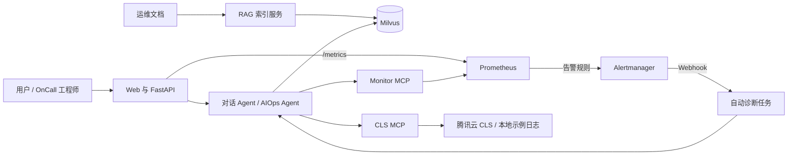

# AI 智能运维与 OnCall 诊断平台

一个面向研发与运维场景的 AI 故障诊断原型。系统将运维知识库、Prometheus 指标与告警、腾讯云 CLS 日志查询统一到自然语言入口，并通过 Plan-Execute-Replan 工作流生成可追踪的诊断过程和处置建议。

[](https://www.python.org/)
[](https://fastapi.tiangolo.com/)
[](LICENSE)

## 核心能力

- **智能对话**：基于 LangChain/LangGraph 的工具调用对话，支持普通响应和 SSE 流式响应。
- **RAG 知识库**：上传 Markdown 或文本文件，完成分块、向量化、Milvus 存储和 Top-K 检索。
- **AIOps 诊断**：通过 Planner、Executor、Replanner 自动规划排障步骤并生成诊断报告。
- **真实可观测数据**：FastAPI 暴露请求量、错误率、延迟、CPU、内存及诊断任务指标。
- **自动告警闭环**：Prometheus 触发规则后由 Alertmanager 回调应用，并自动创建诊断任务。
- **MCP 工具接入**：Monitor MCP 查询真实 Prometheus 数据；CLS MCP 可连接腾讯云日志或使用本地示例数据。

## 系统架构



一次自动诊断的基本流程：

1. FastAPI 持续暴露应用运行指标。
2. Prometheus 每 15 秒采集指标并计算告警规则。
3. 告警进入 `firing` 后，Alertmanager 调用 `/api/alerts/webhook`。
4. 后台创建 AIOps 诊断任务，查询 Prometheus、CLS 和 Milvus。
5. Planner、Executor、Replanner 迭代执行并生成根因、证据与处置建议。
6. 告警恢复后，任务状态同步更新为 `resolved`。

## 快速开始

### 环境要求

- Python 3.11、3.12 或 3.13
- Docker Desktop 或兼容的 Docker Engine
- 阿里云 DashScope API Key（[获取地址](https://dashscope.aliyun.com/)）
- Git
- Node.js 18+（可选；只有接入官方腾讯云 CLS MCP 时需要）

### Windows

```powershell
# 1. 克隆项目
git clone https://github.com/relievedkk/ai-oncall-diagnosis-platform.git
cd ai-oncall-diagnosis-platform

# 2. 创建本地配置
Copy-Item .env.example .env
notepad .env

# 3. 至少把 DASHSCOPE_API_KEY 修改为真实值，然后一键启动
.\start-windows.bat
```

启动脚本会依次完成：

- 创建或同步 `.venv`
- 启动 Milvus、MinIO 和 Attu
- 启动 Prometheus、Alertmanager、Node Exporter 和 cAdvisor
- 启动 CLS MCP 与 Monitor MCP
- 启动 FastAPI
- 上传 `aiops-docs` 中的示例知识文档

停止全部服务并保留数据卷：

```powershell
.\stop-windows.bat
```

### Linux/macOS

```bash
# 1. 克隆项目
git clone https://github.com/relievedkk/ai-oncall-diagnosis-platform.git
cd ai-oncall-diagnosis-platform

# 2. 安装 uv 并同步依赖
python3 -m pip install uv
uv sync

# 3. 创建本地配置并填写 DASHSCOPE_API_KEY
cp .env.example .env
vim .env

# 4. 启动完整系统、等待就绪并上传示例文档
make init
```

后续可使用：

```bash
make start       # 启动 Milvus、监控栈、MCP 和 FastAPI
make stop        # 停止全部服务，保留 Docker 数据卷
make restart     # 重启全部服务
make check       # 检查 FastAPI 健康状态
make status-mcp  # 查看 MCP 服务状态
```

## 服务入口

| 服务 | 地址 | 用途 |
|---|---|---|
| Web 应用 | http://localhost:9900 | 对话、上传知识文档、启动 AIOps 诊断 |
| API 文档 | http://localhost:9900/docs | 查看并调试 FastAPI 接口 |
| 应用指标 | http://localhost:9900/metrics | 查看 Prometheus 格式的原始指标 |
| Prometheus | http://localhost:9090 | 查询指标、目标状态和告警规则 |
| Alertmanager | http://localhost:9093 | 查看正在触发或已恢复的告警 |
| Attu | http://localhost:8001 | 查看和管理 Milvus 中的向量数据 |

## 配置

先复制模板：

```bash
cp .env.example .env
```

最少需要填写：

```dotenv
DASHSCOPE_API_KEY=你的真实密钥
```

常用配置：

```dotenv
# 本地演示默认关闭认证
AUTH_ENABLED=false
API_KEY=

# MCP
MCP_CLS_TRANSPORT=streamable-http
MCP_CLS_URL=http://127.0.0.1:8003/mcp
MCP_MONITOR_TRANSPORT=streamable-http
MCP_MONITOR_URL=http://127.0.0.1:8004/mcp

# Prometheus 与服务映射
PROMETHEUS_BASE_URL=http://127.0.0.1:9090
SERVICE_CATALOG_PATH=config/service_catalog.json

# 默认禁止故障注入
FAULT_INJECTION_ENABLED=false
```

完整字段及安全说明见 [.env.example](.env.example)。`.env` 已加入 `.gitignore`，不要把真实密钥提交到仓库。

### API 认证

本地演示可保持：

```dotenv
AUTH_ENABLED=false
```

公网或共享环境必须启用认证：

```dotenv
AUTH_ENABLED=true
API_KEY=请替换为足够长的随机值
```

启用后：

- Web 左侧边栏填写 API Key；它只保存在当前浏览器的 `sessionStorage` 中。
- API 客户端通过 `X-API-Key` 请求头发送密钥。
- Windows 启动脚本和 Makefile 上传命令会从 `.env` 读取 API Key。

### Alertmanager Webhook 认证

本地 Compose 默认将 `ALERTMANAGER_WEBHOOK_TOKEN` 留空。生产环境如启用该变量，还必须在 Alertmanager 的 `webhook_configs.http_config.authorization` 中配置相同的 Bearer Token，并通过密钥文件或密钥管理系统注入；不要把真实 Token 写进仓库。

## 手动启动与排查

一键脚本失败时，可以分别启动组件。以下 PowerShell 命令使用不同终端窗口执行。

```powershell
# 终端 1：Docker 依赖
docker compose -f vector-database.yml up -d
docker compose -p oncallagent-monitoring -f monitoring.yml up -d --build

# 终端 2：本地 CLS MCP
.\.venv\Scripts\python.exe mcp_servers\cls_server.py

# 终端 3：Monitor MCP
.\.venv\Scripts\python.exe mcp_servers\monitor_server.py

# 终端 4：FastAPI
.\.venv\Scripts\python.exe -m uvicorn app.main:app --host 0.0.0.0 --port 9900
```

文档可以直接从 Web 页面上传。启用认证时，先在左侧填写 API Key。

## API

| 功能 | 方法 | 路径 | 认证 |
|---|---|---|---|
| 首页 | GET | `/` | 否 |
| 健康检查 | GET | `/health` | 否 |
| 应用指标 | GET | `/metrics` | 否 |
| 普通对话 | POST | `/api/chat` | 是 |
| 流式对话 | POST | `/api/chat_stream` | 是 |
| 清空会话 | POST | `/api/chat/clear` | 是 |
| 会话历史 | GET | `/api/chat/session/{session_id}` | 是 |
| 上传并索引文件 | POST | `/api/upload` | 是 |
| 索引允许目录 | POST | `/api/index_directory` | 是 |
| 手动 AIOps 诊断 | POST | `/api/aiops` | 是 |
| 自动诊断任务列表 | GET | `/api/aiops/jobs` | 是 |
| 自动诊断任务详情 | GET | `/api/aiops/jobs/{diagnosis_id}` | 是 |
| Alertmanager 回调 | POST | `/api/alerts/webhook` | API Key 或独立 Bearer Token |
| 本地故障注入 | POST | `/api/debug/fault/{state}` | 是，且默认关闭 |

当 `AUTH_ENABLED=false` 时，表格中的认证接口也可在本地直接访问。

### 请求示例

```bash
# AUTH_ENABLED=false 时 API_KEY 可以留空
API_KEY=""

curl -X POST "http://localhost:9900/api/chat" \
  -H "Content-Type: application/json" \
  -H "X-API-Key: ${API_KEY}" \
  -d '{"Id":"session-123","Question":"当前系统有哪些告警？"}'

curl -N -X POST "http://localhost:9900/api/aiops" \
  -H "Content-Type: application/json" \
  -H "X-API-Key: ${API_KEY}" \
  -d '{"session_id":"session-123"}'
```

## 本地端到端告警测试

故障注入接口默认关闭，只能在隔离的本地测试环境临时启用。

1. 在 `.env` 中设置 `FAULT_INJECTION_ENABLED=true`。
2. 重启 FastAPI。
3. 触发故障并等待 Prometheus 和 Alertmanager 完成一次规则计算与转发。

```powershell
$headers = @{}
# AUTH_ENABLED=true 时取消下一行注释并填入真实 API Key
# $headers["X-API-Key"] = "your-api-key"

Invoke-RestMethod -Method Post -Headers $headers http://localhost:9900/api/debug/fault/active
Start-Sleep -Seconds 30
Invoke-RestMethod -Headers $headers http://localhost:9900/api/aiops/jobs

# 测试完成后恢复
Invoke-RestMethod -Method Post -Headers $headers http://localhost:9900/api/debug/fault/resolved
```

测试结束后将 `FAULT_INJECTION_ENABLED=false` 并重启应用。

## 项目结构

```text
ai-oncall-diagnosis-platform/
├── app/
│   ├── agent/aiops/                 # Planner、Executor、Replanner
│   ├── api/                         # 对话、文件、告警、指标和调试接口
│   ├── core/                        # 配置、认证、LLM、Milvus、指标
│   ├── models/                      # API 与告警数据模型
│   ├── services/                    # RAG、向量库、自动诊断与服务目录
│   ├── tools/                       # 知识库、时间和 Prometheus 工具
│   └── main.py                      # FastAPI 入口
├── aiops-docs/                      # 示例运维知识文档
├── config/service_catalog.json      # 服务、Prometheus 和 CLS 映射
├── mcp_servers/                     # CLS MCP 与 Monitor MCP
├── monitoring/                      # Prometheus 与 Alertmanager 配置
├── static/                          # Web 前端
├── tests/                           # 自动化测试
├── .env.example                     # 安全配置模板
├── monitoring.yml                   # 监控栈 Docker Compose
├── vector-database.yml              # Milvus Docker Compose
├── start-windows.bat                # Windows 一键启动
├── stop-windows.bat                 # Windows 一键停止
├── Makefile                         # Linux/macOS 管理命令
└── pyproject.toml                   # Python 项目与依赖配置
```

## 开发与测试

```bash
# 同步开发依赖
uv sync --extra dev

# 运行测试
uv run pytest -q

```

## 安全与生产部署说明

仓库内的 Compose 文件面向本地开发，不能原样暴露到公网：

- MinIO 使用本地默认凭证，并映射了管理端口。
- Prometheus、Alertmanager、Milvus 和 Attu 默认映射到宿主机端口。
- cAdvisor 使用特权模式并读取 Docker/宿主机相关目录。
- `/metrics`、`/health` 和 API 文档为公开端点。
- FastAPI 监听 `0.0.0.0`，以便 Docker 内的 Prometheus 通过 `host.docker.internal` 抓取指标；请使用主机防火墙限制外部访问。
- 本地示例 CLS 返回演示数据，不代表真实生产日志。

生产环境至少应完成：网络隔离、TLS、强认证、密钥管理、最小权限、固定镜像版本、数据备份、审计日志和高可用部署。

## 常见问题

### Web 可以打开，但聊天或上传返回 503

通常是 `AUTH_ENABLED=true` 但没有设置 `API_KEY`。设置 API Key 后重启应用，并在 Web 左侧填写相同值；本地演示也可以明确设置 `AUTH_ENABLED=false`。

### Milvus 连接失败

```bash
docker compose -f vector-database.yml ps
docker compose -f vector-database.yml restart standalone
```

### Prometheus 没有数据

1. 确认 http://localhost:9900/metrics 可以打开。
2. 在 Prometheus 的 `Status → Targets` 检查 `ai-oncall-agent` 是否为 `UP`。
3. Docker Desktop 环境需支持通过 `host.docker.internal` 访问宿主机。

### 端口被占用

```powershell
netstat -ano | findstr :9900
taskkill /F /PID <PID>
```

主要端口：`9900`、`8001`、`8003`、`8004`、`9090`、`9093`、`19530`。

## 参考资源

- [FastAPI](https://fastapi.tiangolo.com/)
- [LangChain](https://python.langchain.com/)
- [LangGraph](https://langchain-ai.github.io/langgraph/)
- [Milvus](https://milvus.io/)
- [Prometheus](https://prometheus.io/)
- [Model Context Protocol](https://modelcontextprotocol.io/)
- [阿里云 DashScope](https://dashscope.aliyun.com/)

## 许可证

本项目采用 [MIT License](LICENSE)。
